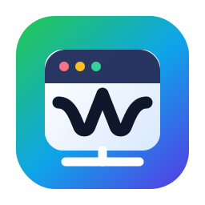

# Linux WebApp Maker



Create Linux desktop apps from URLs.

This version uses an isolated Electron runtime for created apps. It does not open Firefox, Chrome, Chromium, or another external browser window. Electron still uses Chromium internally, but as an app runtime bundled for this tool.

## Install

```sh
chmod +x install.sh install-deps.sh
./install.sh
./install-deps.sh
```

Then open **Web App Maker** from the application menu.

## Why Electron

Sites like Apple Music are heavy and modern. The older WebKitGTK runner could fail or freeze the desktop. Electron is heavier to install, but it is much more compatible with sites such as `https://music.apple.com/`.

The runner also starts with GPU-compositing disabled to reduce full-desktop hangs on problematic drivers.

## Generated Apps

Each generated app gets:

- its own `.desktop` file;
- its own app id, for example `io.github.linuxwebappmaker.apple_music`;
- a matching `StartupWMClass`, so the taskbar can match the pinned icon to the running window;
- a local icon downloaded from the URL;
- an optional custom icon selected by the user;
- a separate profile folder.

The maker window is capped to a compact size, and generated app windows open at a smaller default size with a maximum window size to avoid oversized first launches.

The maker also includes an **Installed Apps** panel. It lists apps created by Linux WebApp Maker and lets you open or remove them. Removal deletes the menu entry, launcher script, app icon/profile folder, optional desktop shortcut, and tries to unpin the app from KDE Plasma or GNOME favorites.

## Files

- Maker: `~/.local/bin/linux-webapp-maker`
- Runner: `~/.local/bin/linux-webapp-runner`
- Runtime: `~/.local/share/linux-webapp-maker/`
- Generated menu files: `~/.local/share/applications/io.github.linuxwebappmaker.*.desktop`
- Generated app data: `~/.local/share/linux-webapp-maker/apps/`

## Apple Music Note

Apple Music may still restrict playback if the site requires DRM features not available in the installed Electron build. The app window should open, but playback support depends on the site and Electron runtime capabilities.
